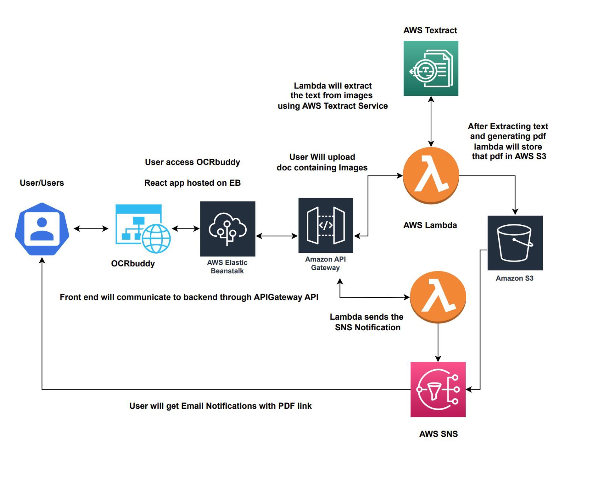

# OCRbuddy
The "OCRbuddy" project is a simple web application designed to simplify extracting text from images or PDFs and converting them into downloadable PDFs. Leveraging Amazon Web Services (AWS), OCRbuddy seamlessly integrates AWS Lambda, API Gateway, S3, Elastic Beanstalk, and SNS services to deliver a reliable, scalable, and secure OCR (Optical Character Recognition) solution. The primary goal of OCRbuddy is to help users effortlessly extract and manage textual information from images or PDF documents, enhancing productivity; this app can help students, professors, educators, and anyone who can use it.

# Project Objective
Text Extraction: OCRbuddy aims to provide users with a straightforward platform to upload images or PDFs and automatically extract the textual content using AWS TextExtract services.

PDF Generation: Upon extracting the text from the uploaded files, OCRbuddy converts it into a well-structured PDF document. Users can then download the PDF, making sharing, storing, and accessing the information more accessible.

Email Notification: OCRbuddy allows users to receive email notifications containing links to the generated PDFs. By integrating AWS SNS (Simple Notification Service), users can subscribe and conveniently receive links to their converted documents in their email inbox.

# Final Architecture

OCRbuddy's final architecture leverages various AWS cloud mechanisms to deliver a scalable and efficient OCR (Optical Character Recognition) web application. The cloud mechanisms used in the architecture are:

1. AWS Elastic Beanstalk: Hosts the frontend application, providing an easy-to-use platform for deploying, managing, and scaling web applications.

2. AWS Lambda: Executes serverless functions for OCR processing, text extraction, PDF generation, and email notification. Lambda allows automatic scaling based on request volume.

3. AWS API Gateway: Serves as the entry point for users to interact with the application. It forwards HTTP requests to the corresponding Lambda functions for processing.

4. Amazon S3: Stores the generated PDFs, making them accessible for users to download. S3 provides high durability, availability, and security for data storage.

5. AWS Simple Notification Service (SNS): Enables email notifications for users who request them. It sends PDF links to the provided email addresses; the message only goes if the user confirms the subscription.

6. AWS Textract: Takes an image or PDF as input, processes the machine learning OCR, and gives the text as output, which is then used to generate the PDF.

   
